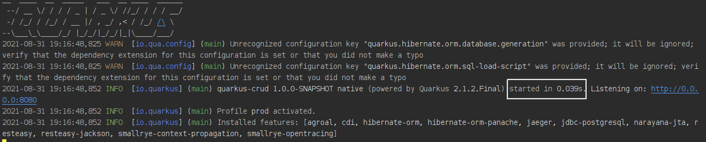

# Quarkus CRUD POC

### Sobre a POC
Esta POC tem por objetivo explorar o uso do framework Quarkus para criação de endpoints *REST* referentes a um cadastro simples de produtos (*CRUD*)

### Tecnologias adotadas
Esta solução utilizou-se da seguinte stack:
+ ***Quarkus***: *Quarkus* é um framework Java voltado para containers e de stack completa, o qual permite tanto a compilação voltada para JVM quanto a nativa. Além disso ele traz a proposta de otimizar o tempo de boot das aplicações e reduzir seu consumo de memória. Seu slogan é: Quarkus, o framework Java supersônico e subatômico.

+ ***Jaeger com OpenTracing***: *Jaeger* é um software open source aderente ao padrão OpenTracing para rastreamento de transações entre serviços distribuídos. Ele é usado para monitorar e solucionar problemas em ambientes de microsserviços complexos. OpenTracing é parte integrante da especificação do *Microprofile*, sendo a parte responsável por definir comportamentos e APIs para acessar objetos de rastreamento aderentes ao padrão OpenTracing.

+ ***RESTEasy com Jackson***: *RESTEasy* é uma implementação da especificação *JAX-RS* (Java API for RESTful Web Services). JAX_RS é parte integrante da especificação do *Microprofile* e define padrões para APIs de cliente e servidor.  Jackson é uma biblioteca que permite a serialização e deserialização de objetos (conversão entre objetos Java e suas representações em String JSON).

+ ***JPA com Hibernate e Panache***: *Hibernate* é um framework ORM (object Relational Mapper) que implementa a especificação JPA (Java Persistence API). Panache é uma extensão do Quarkus que facilita a criação de entidades e torna mais simples o uso do Hibernate. Na solução em questão, foi adotado o uso do padrão Active Record implementado pelo Panache, o qual dispensa o uso de classes DAO ou Repositories, simplificando a solução.

+ ***PostgreSQL*** : banco de dados relacional como forma de persistência dos dados.

+ ***Docker e docker-compose***: *Docker* é uma tecnologia que permite aos desenvolvedores empacotar, entregar e executar aplicações em containers Linux leves e autossuficientes. *Docker-compose* é uma ferramenta para definição e execução de múltiplos containers. Reuni todas as depedências externas do projeto no arquivo `docker-compose-dependencies.yml` , permitindo desta forma subir os serviços pelos quais dependo usando o *docker-compose.*

  

##### Tempo de inicialização da POC com a compilação nativa

 


## Passos para compilar e testar a solução

#### Subir as dependências externas

A partir da pasta raíz do projeto, execute o comando: `docker-compose -f ./src/main/docker/docker-compose-dependencies.yml up`

#### Acessar o Jaeger UI para visualizar as transações

Abra a página http://localhost:16686

#### Acessar o admin do Postgres (pgAdmin 4)

Abra a página http://localhost:16543 e efetue login utilizando as credenciais abaixo:
*Email*: `renato.schoene@email.com.br`
*Password*: `root`

#### Importar collection de exemplo no Postman

importe o arquivo `src/main/resources/QuarkusCrud.postman_collection.json` no Postman para chamar os endpoints do serviço REST

#### Compilar e iniciar a aplicação em modo de desenvolvimento

A partir da raíz do projeto, execute o comando abaixo para compilar e executar a aplicação em modo de desenvolvimento, o qual permite live-reload e disponibiliza o DEV UI:
```shell script
./mvnw compile quarkus:dev
```

> **_NOTE:_**  a página do Dev UI pode ser acessada pelo endereço http://localhost:8080/q/dev/ , ficando disponível apenas no modo DEV.

#### Gerar executável JVM da aplicação

Rode o comando abaixo para gerar o  arquivo`quarkus-run.jar` no diretório `target/quarkus-app/`:
```shell script
./mvnw package
```
Este Jar não é completo, sendo que suas dependências são geradas no diretório `target/quarkus-app/lib/`.

Caso opte por ter um Jar completo (já com suas dependências), rode o comando:
```shell script
./mvnw package -Dquarkus.package.type=uber-jar
```

A aplicação pode ser executada pelo comando abaixo:

 `java -jar target/quarkus-app/quarkus-run.jar`.

#### Gerar executável nativo da aplicação

Execute o comando abaixo para realizar a compilação nativa da aplicação: 
```shell script
./mvnw package -Pnative
```

ou, se você não possuir o GraalVM instalado, você pode gerar um executável nativo em container rodando: 
```shell script
./mvnw package -Pnative -Dquarkus.native.container-build=true
```

Rode o comando abaixo para executar a aplicação nativa:

 `./target/quarkus-crud-1.0.0-SNAPSHOT-runner`
